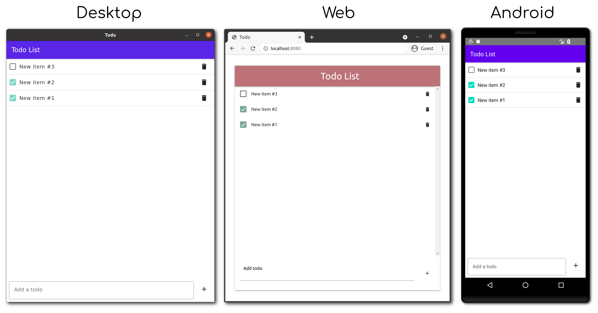

An example of Kotlin Multiplatform todo app with shared Jetpack Compose UI.

Supported targets: `Android` and `JVM`.

Libraries used:
- Jetpack Compose - shared UI
- [Decompose](https://github.com/arkivanov/Decompose) - navigation and lifecycle
- [MVIKotlin](https://github.com/arkivanov/MVIKotlin) - presentation and business logic
- [Reaktive](https://github.com/badoo/Reaktive) - background processing and data transformation
- [SQLDelight](https://github.com/cashapp/sqldelight) - data storage

There are multiple common modules:
- `utils` - just some useful helpers
- `database` - SQLDelight database definition
- `main` - displays a list of todo items and a text field
- `edit` - accepts an item id and allows editing
- `root` - navigates between `main` and `edit` screens

The `root` module is integrated into both Android and Desktop apps.

Features:
- 99% of the code is shared: data, business logic, presentation, navigation and UI
- View state is preserved when navigating between screens, Android configuration change, etc.
- Model-View-Intent (aka MVI) architectural pattern

### Running desktop application
```
./gradlew :desktop:run
```

### Building native desktop distribution
```
./gradlew :desktop:package
# outputs are written to desktop/build/compose/binaries
```

### Running Android application

Open project in Intellij IDEA or Android Studio and run "android" configuration.


